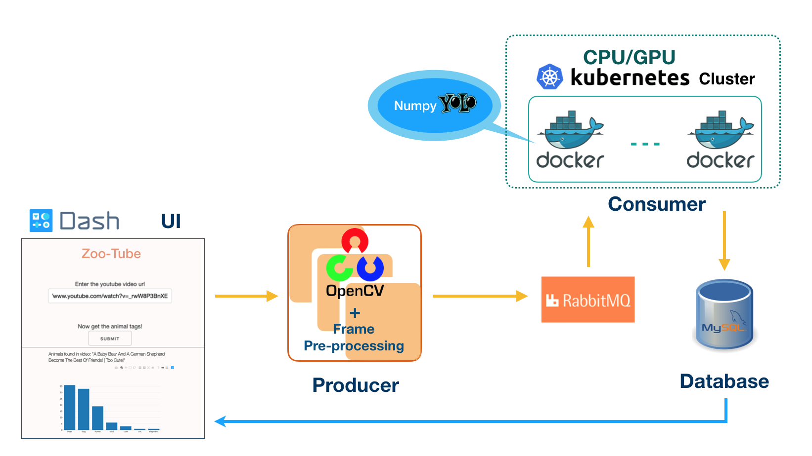

# Insight Data Engineering Project 2019B

---

## Table of Contents
* [Project Overview](README.md#project-overview)
* [Architecture](README.md#architecture)
* [System Running Instruction](README.md#system-running-instruction)
  * [Repo directory structure](README.md#repo-directory-structure)
  * [System Setup Procedure](README.md#system-setup-procedure)
  * [System Running](README.md#system-running)
* [Questions?](README.md#questions?)


## Project Overview

If you want to see your favorite bear in an hourly long video, and avoid wasting time to watch through the whole video.
My application will offer you a quick summary of animals shown up in the video and provides the links that you can jump to see your favorite animal with one click. The 30 mins long video can be processed within one minutes, you can use this as a quick preview. Further, with available ML models, this idea can be extrapolated to applications like instant check of long surveillance video to find endangered animals, to find suspects.; quick investigate for drug, weapon usage in movie; and more area. 

### Video demo

[demo link]()

### Approach

- **YOLO + Cloud Computing-AWS EC2**
- YOLO is object detection application in Neural Network model **Darknet**. It can detect animals in image. Refer to [here](https://pjreddie.com/darknet/yolo/). In this project, video frames are processed with Python CV2 where the images are converted to Numpy array. To make YOLO compatible with Numpy input, Darknet was modified, please go to my [NumpyDarknet](https://github.com/fanxia/numpydarknet_gpu) repo to check more.
- Cloud Computing helps to scale up the computing ability. Here, **AWS EC2** service is used to launch kubernetes cluster. The Docker containers are deployed in it.

## Architecture



In the UI web, enter the youtube video link and click submit. The producer will be triggered then and start processing video into frames along with pre-processing of image. Frames are send to queue in RabbitMQ. The consumers (YOLO implemented) deployed in kubernetes cluster on AWS are listening to the queue and analyzing the frames. Detection results are then sent to MySQL Database, the UI queries the DB to retrieve the results and show the bar plot.

---

## System Running Instruction

### Repo directory structure

The project directory is structured in this way:

    ├── README.md
    ├── Zoo-Tube
        ├── src
            ├── anitag_app.py  # Web application      
            ├── publisher.py
            ├── consumer.py
            └── config.json 
        ├── k8scluster        # Deploy docker to k8s cluster
            ├── deployment.yml
            └── service.yml
        ├── dockerimage       # Build docker image as consumer
            └── Dockerfile
        ├── test   # test space for development


### System Setup Procedure
  1. Build consumer docker image
  1. Deploy consumer to kubernetes cluster on AWS
  1. Build app server with publisher

#### **1. Build consumer docker image with YOLO implemented**
 *Pre-requirement: intall docker and sign up at dockerhub.*
- Build NumpyDarknet docker image to run YOLO. Details in https://github.com/fanxia/numpydarknet_gpu.
- Build Consumer docker image, name as anitag (short for animal-tag), and push it to dockerhub.
```
$ git clone https://github.com/fanxia/InsightDE_project.git
```
modify the `config.json` file in `Zoo-Tube/src/` with the correct rabbitMQ and Mysql db connections.

```
$ cd Zoo-Tube/dockerimage/
$ sudo docker build  --no-cache -t fanxia08/anitag_gpu:v1 .
$ docker push fanxia08/anitag_gpu:v1 .
```
- Docker image is ready for deployment as the consumer now!


#### **2. Deploy consumer to kubernetes cluster on AWS**
 *Pre-requirement: spin up k8s cluster on AWS EC2. Refer to [k8s_instruction](https://github.com/fanxia/InsightDE_project/blob/master/AnimalTag/k8scluster/k8s_instruction.md)* 
- GPU consumer
```
$ cd Zoo-Tube/k8scluster/
$ kubectl create -f deployment_gpu.yml
$ kubectl create -f service_gpu.yml
```

- CPU consumer
```
$ cd Zoo-Tube/k8scluster/
$ kubectl create -f deployment.yml
$ kubectl create -f service.yml
```

- Scale up/down replicas in k8s cluster ( Example in GPU mode)
Modify the replicas number in deployment_gpu.yml
```python
spec:
  replicas: 4
  selector:
    matchLabels:
      app: app-gpu
```
Apply the updates to k8s.
```
$ kubectl apply -f deployment_gpu.yml
```

- Check deployment and service status in k8s cluster.
```
$ kubectl get deployment
$ kubectl describe deployment app-gpu
$ kubectl get svc
$ kubectl describe svc webapp1-svc
```

- Delete deployment and service in k8s cluster.
```
$ kubectl delete deployment app-gpu
$ kubectl delete svc app-gpu
```

#### **3. Build app server with publisher**
- *Pre-requirement: spin up a new instance in EC2 to serve the web application which employs the publisher automatically.*
```
$ git clone https://github.com/fanxia/InsightDE_project.git
$ cd Zoo-Tube/src
```

### System Running
- Log into the application server instance
```
$ ssh -i keypair.pem ubuntu@xxxec2.aws.com
$ cd InsightDE_project/Zoo-Tube/src
$ python3 anitag_app.py
```
**The web is live now!**

# Questions?
Email me at fanxia08@gmail.com